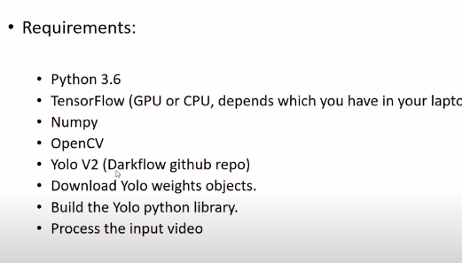
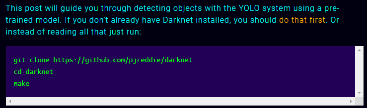
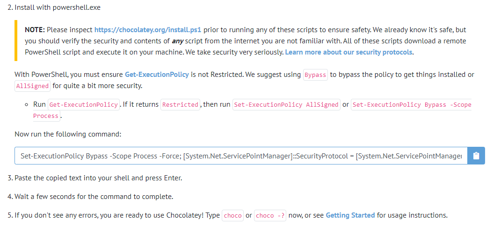
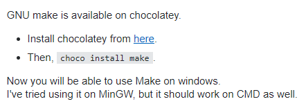
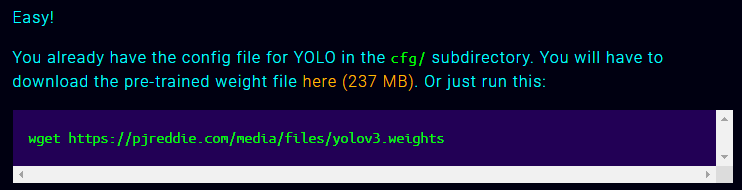
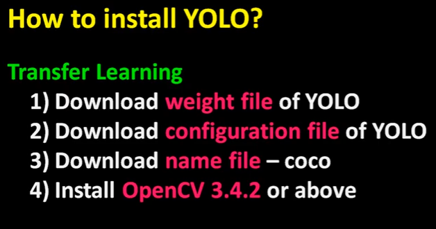
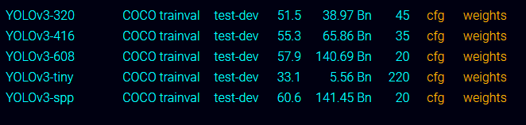

# YOLOv3 (You Only Look Once)

### How to use?

- First need to download git. It’s easy. search in the google and select download for windows
- Go to the folder where you want to run the juputer notebook.
- Then, open right click & select “Git Bash Here”.
- address - https://pjreddie.com/darknet/yolo/

- It will take some time to clone.
- Now the problem is **make** command will not work. see this from stackoverflow: https://stackoverflow.com/questions/32127524/how-to-install-and-use-make-in-windows

Total installation procedure is exhausting.

- We need to install chocolatey
- Go to this website for details - https://chocolatey.org/install

- install wget from here: https://eternallybored.org/misc/wget/ or you can download the file from the link
- My internet connection is very slow, as it’s 237 MB, it’s taking very long time.

- weight files are core of the model, we use this to train the model

- I’m downloading the 2nd one – YOLOv3-416

---

### Deep SORT

SORT = Simple Online and Real-time Tracking

get help:

1. https://medium.com/analytics-vidhya/yolo-v3-real-time-object-tracking-with-deep-sort-4cb1294c127f

2. https://towardsdatascience.com/people-tracking-using-deep-learning-5c90d43774be
